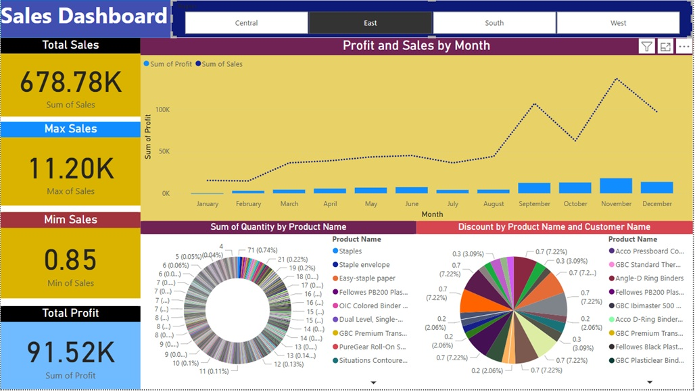
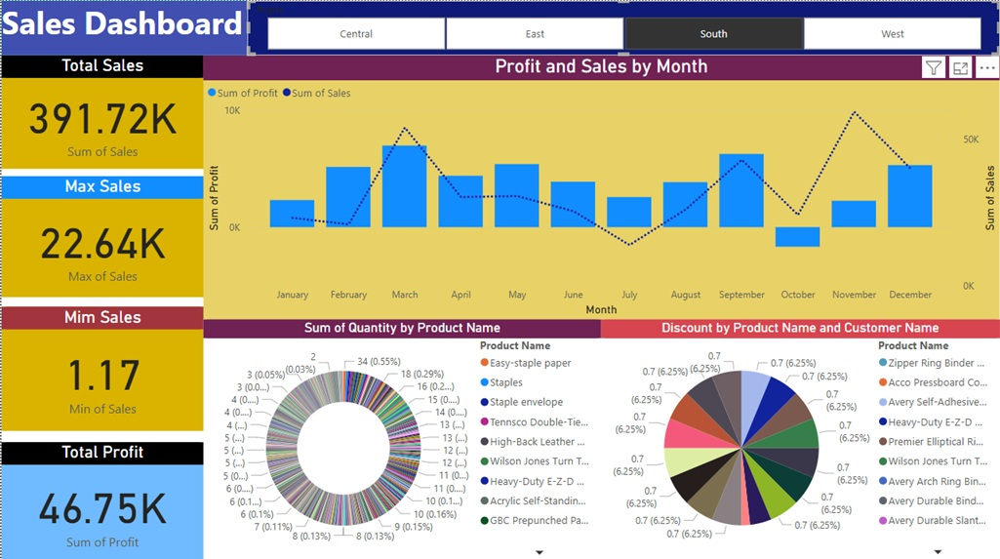
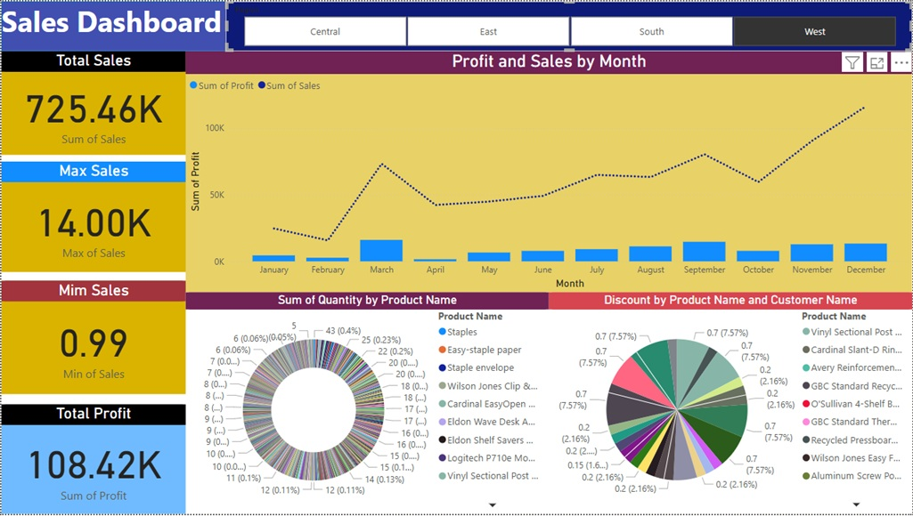

# Superstore Regional Sales Performance Power BI Dashboard

## 📊 Dashboard 1: Central Region

### Key Insights

**•	Total Sales:** 501.24K

**•	Key Observation:** Sales performance is moderate with relatively stable profits throughout the year. A noticeable peak occurs in September, indicating a sales boost during that period.

**•	Business Implication:** Consistent performance but with room to explore what drives the September spike for potential scaling.

## 📊 Dashboard 2: East Region

### Key Insights

**•	Total Sales:** 678.78K

**•	Key Observation:** Sales steadily increase over the months, peaking in September and November. The profit trend aligns closely with the sales growth.

**•	Business Implication:** The East region demonstrates strong growth potential. Focused marketing during the latter part of the year could further boost profitability.

## 📊 Dashboard 3: South Region

### Key Insights

**•	Total Sales:** 391.72K

**•	Key Observation:** Sales in this region are comparatively lower, but the profit per sale appears higher. Sales are more volatile with noticeable monthly fluctuations.

**•	Business Implication:** This region shows potential but requires strategies to stabilize monthly sales and maintain customer loyalty.

## 📊 Dashboard 4: West Region

### Key Insights

**•	Total Sales:** 725.46K

**•	Key Observation:** The West region outperforms all others with the highest total sales and profits. There is a continuous growth trend throughout the year.

**•	Business Implication:** This region is the top performer. Investment in inventory, marketing, and customer retention here could drive even higher returns.

