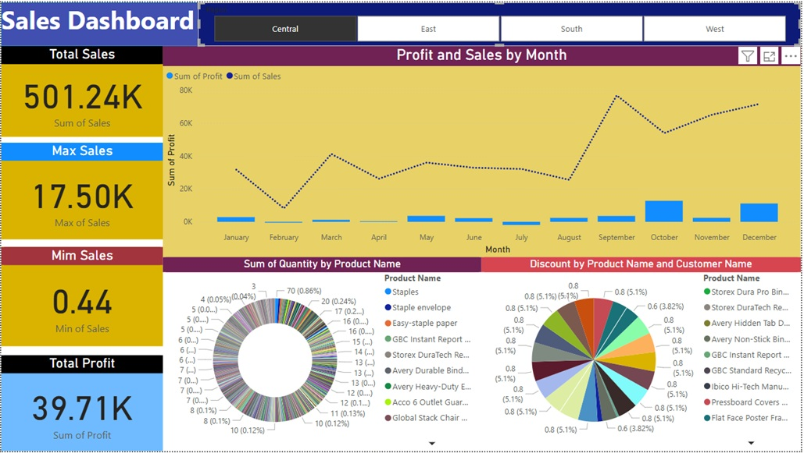

# Superstore Regional Sales Performance Power BI Dashboard

**📊 Dashboard 1:** Central Region
**•	Total Sales:** 501.24K
**•	Key Observation:** Sales performance is moderate with relatively stable profits throughout the year. A noticeable peak occurs in October, indicating a sales boost during that period.
**•	Business Implication:** Consistent performance but with room to explore what drives the October spike for potential scaling.
